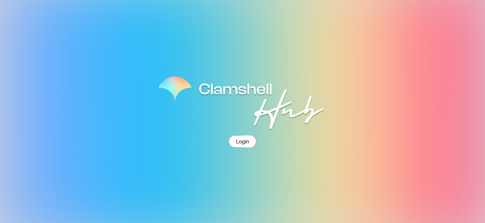
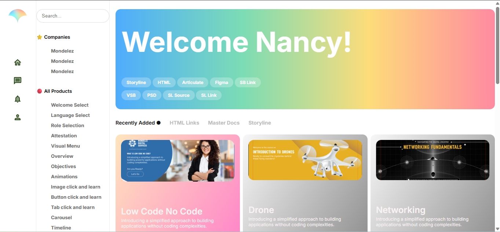

# Clamshell Learning Platform

A frontend web project inspired by **Clamshell Learning**, created to showcase a clean, modern, and user-friendly learning platform interface using core frontend technologies.

## 🌐 Project Overview

The **Clamshell Learning Platform** is a frontend-only web application that represents how an online learning or training platform can look and function.

The main objective of this project is to practice:
- Real-world frontend development
- Professional project structure
- Clean UI design
- Proper GitHub documentation

---

## 🚀 Features

- Modern and clean UI
- Responsive page layout
- Structured sections for learning content
- Interactive buttons and navigation
- Reusable CSS styles
- Beginner-friendly and readable code

---

## 🛠️ Technologies Used

- **HTML5** – Page structure  
- **CSS3** – Styling and layout  
- **JavaScript (ES6)** – Interactivity  
- **Git & GitHub** – Version control  

## 📸 Screenshots

